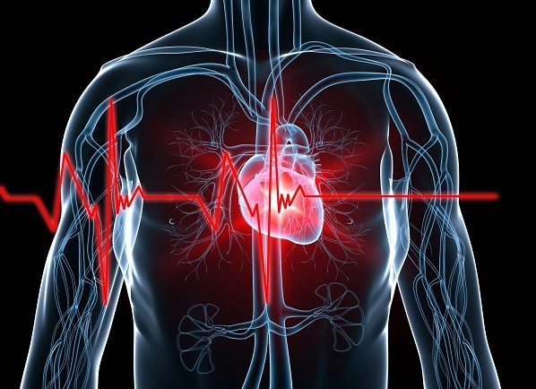

Heart Disease Prediction: For a Healthier Life
=======================
 
**Logistic Regression performed with 90% of accuracy on its predictions**
 

## Introduction

Heart disease is one of the biggest causes of morbidity and mortality among the population of the world. As reported by World Health Organization (WHO), Heart Disease and Stroke are the world’s biggest killers and have remained the leading causes of death globally in the last 15 years. 

Prediction of cardiovascular disease is regarded as one of the most important subjects in the section of clinical data analysis. The amount of data in the healthcare industry is huge. Data mining turns the large collection of raw healthcare data into information that can help to make informed decisions and predictions. Machine Learning can present remarkable features that simplify the identification of unseen patterns, eventually providing clinical insights that assist physicians in planning and providing care.  In this analysis, the presence of heart disease is predicted by employing Logistic regression and Tree Based Models.

You can find the detailed article in markdown format in the [RPubs](https://rpubs.com/AndoFreitas/771220).

--------------------------------------------------------------------------------------------

## The Data

The Heart Disease dataset has been taken from [Kaggle.](https://www.kaggle.com/cherngs/heart-disease-cleveland-uci) This data contains 76 attributes, but all published experiments refer to using a subset of 14 of them. It has a total number of 297 rows and 14 columns among which 137 have a heart disease. You can check the original dataset [here.](https://archive.ics.uci.edu/ml/datasets/Heart+Disease) 

* age: age in years
* sex: sex (1 = male; 0 = female)
* cp: chest pain type
    * Value 0: typical angina
    * Value 1: atypical angina
    * Value 2: non-anginal pain
    * Value 3: asymptomatic
* trestbps: resting blood pressure (in mm Hg on admission to the hospital)
* chol: serum cholestoral in mg/dl
* fbs: (fasting blood sugar > 120 mg/dl) (1 = true; 0 = false)
* restecg: resting electrocardiographic results
    * Value 0: normal
    * Value 1: having ST-T wave abnormality (T wave inversions and/or ST elevation or depression of > 0.05 mV)
    * Value 2: showing probable or definite left ventricular hypertrophy by Estes' criteria
* thalach: maximum heart rate achieved
* exang: exercise induced angina (1 = yes; 0 = no)
* oldpeak = ST depression induced by exercise relative to rest
* slope: the slope of the peak exercise ST segment
    * Value 0: upsloping
    * Value 1: flat
    * Value 2: downsloping
* ca: number of major vessels (0-3) colored by flourosopy
* thal: 0 = normal; 1 = fixed defect; 2 = reversable defect
and the label
* condition: 0 = no disease, 1 = disease
